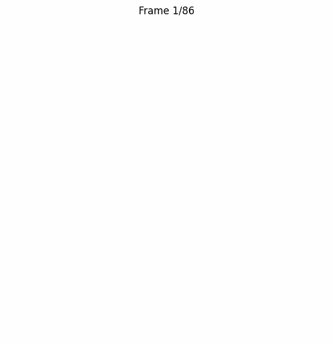
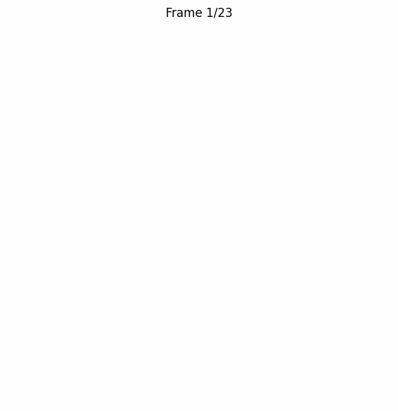

# Sequential Sketch Generation using Conditional RNN & Sketch-RNN

This project implements a deep learning–based sequential sketch generation system that generates vector drawings stroke-by-stroke, mimicking human sketching behavior. Given a class label (e.g., cat, apple, airplane), the model produces a step-by-step sketch using Recurrent Neural Networks (LSTMs) and Mixture Density Networks (MDNs).

Two architectures are implemented:
- ✅ **Single Conditional RNN Decoder**
- ✅ **Router-Based Sketch-RNN (VAE-inspired)**

## 📌 Key Features
- Class-conditional vector sketch generation
- Stroke modeling using Gaussian Mixture Models (GMM)
- Pen-state prediction (pen-down, pen-up, end-of-drawing)
- Temperature-based sampling for diversity control
- Multi-sketch scene generation & animation
- GIF-based visualization outputs

## 📂 Dataset
**[Quick, Draw! Dataset](https://github.com/googlecreativelab/quickdraw-dataset)**

**Classes used:**
- ✈️ Airplane
- ⏰ Alarm Clock
- 🍎 Apple
- 🐱 Cat
- 🕯️ Candle

Each sketch is represented as a sequence of:
` (Δx, Δy, p1, p2, p3) `

Where `p1`, `p2`, `p3` represent pen states.

## 🏗️ Model Architectures

### 1️⃣ Single Model (Conditional RNN Decoder)
- Class Embedding Layer
- LSTM Decoder
- GMM Output Head for `(Δx, Δy)`
- Softmax head for pen state prediction
- **Training:** Trained using Negative Log Likelihood (NLL) only

### 2️⃣ Router-Based Model (Sketch-RNN Inspired)
- Separate Encoder–Decoder (VAE) per class
- Latent vector `z` generation
- **Training:**
  - Reconstruction Loss
  - KL-Divergence Loss

## ⚙️ Training Highlights
- **Optimizer:** Adam
- **Batch Size:** 100
- **Latent Dimension (VAE):** 128
- **GMM Components:** 20
- **Max Sequence Length:** 200
- **Temperature (Sampling):** 0.4
- **Epochs:**
  - 20 (Single Model)
  - 50,000 (Router-Based)

## 🎨 Output Examples
The model generates sketches step-by-step and exports them as animated GIFs:





*(Stroke-by-stroke animated drawings)*

## 🧪 Evaluation

**Qualitative evaluation via:**
- Recognizability
- Stroke coherence
- Class-specific details
- Diversity with temperature variation

**Quantitative evaluation via:**
- Validation NLL loss

## 📁 Project Structure

```text
├── single.ipynb        # Conditional RNN Model
├── router.ipynb        # VAE-based Router Model
├── cat.gif
├── dog.gif
├── book.gif
├── report.pdf
└── README.md

## 🚀 How to Run

1. Open single.ipynb or router.ipynb in Google Colab.
2. Upload Quick Draw .npz files.
3. Train the model.
4. Generate sketches and export as GIFs.